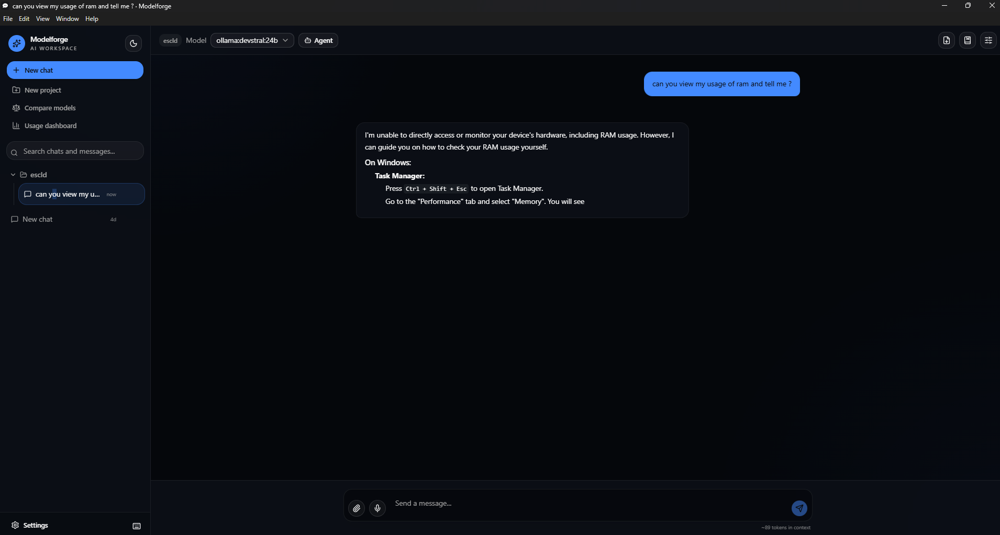
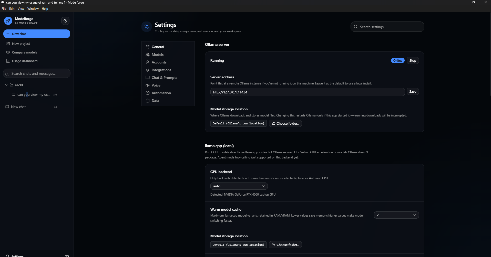
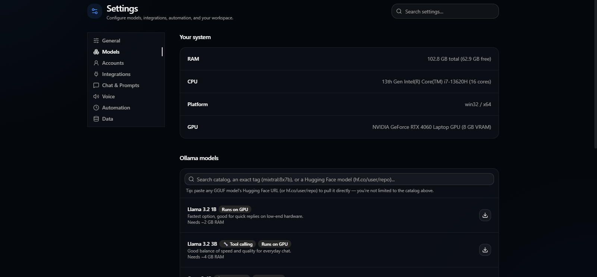
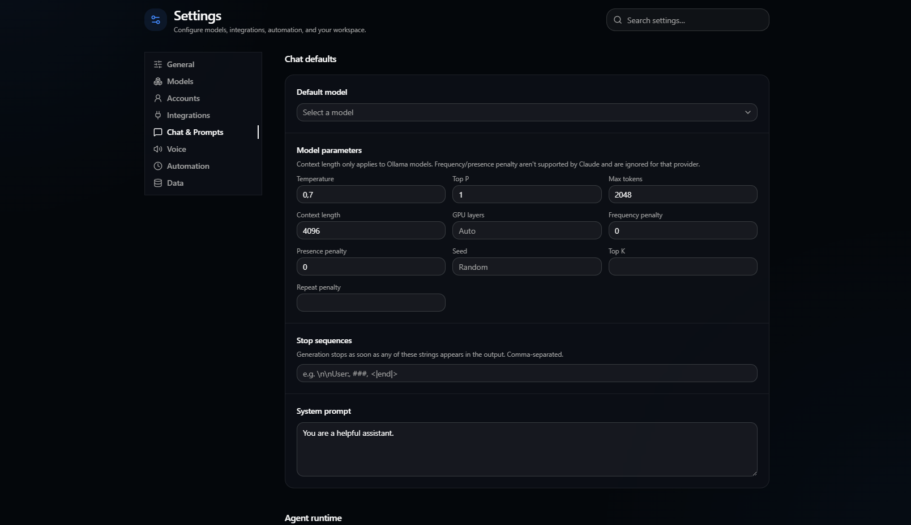
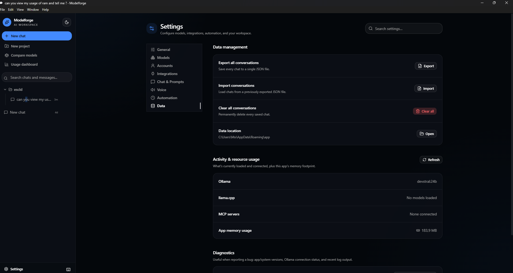

# Modelforge

[](https://github.com/voidstackloop/modelforge/actions/workflows/ci.yml)
[](https://github.com/voidstackloop/modelforge/releases/latest)
[](LICENSE)

A cross-platform desktop client that unifies local and cloud AI models in one interface: [Ollama](https://ollama.com) for local inference, plus OpenAI and Anthropic for cloud models. Built with Electron, React, and TypeScript.

Beyond chat, Modelforge includes an **agentic mode** — the model can read/write files and run shell commands in a folder you choose, with every action gated behind your explicit approval.



## Contents

- [Features](#features)
- [Screenshots](#screenshots)
- [Installation](#installation)
- [Quick start](#quick-start-try-it-in-5-minutes)
- [Agent mode](#agent-mode)
- [Building from source](#building-from-source)
- [Project structure](#project-structure)
- [Testing](#testing)
- [Security](#security)
- [Contributing](#contributing)
- [License](#license)

## Features

**Chat & providers**
- Local Ollama models, OpenAI, and Anthropic in one interface, with token-by-token streaming.
- Vision support — attach images (or extract frames from a video) for models that can see them.
- Live token usage and estimated cost per message and per session (Ollama is free/local; cloud providers show a running estimate).

**Organization**
- **Projects** — group related chats under shared instructions and default model parameters.
- **Per-session and per-project overrides** — pin a specific prompt, model, temperature, seed, top-K/top-P, repeat penalty, context length, GPU offload, or stop sequences to a single chat or an entire project, falling back to sane defaults. Provider-specific parameters (e.g. seed isn't supported by Claude, top-K isn't supported by ChatGPT) are automatically disabled when they don't apply to the selected model.
- **Prompt library** — save and reuse system prompts across chats.
- **Command palette** (`Ctrl/Cmd+K`) — jump between chats, projects, and settings without touching the mouse.

**Files & retrieval**
- Attach files, folders, images, video, and PDFs directly into a conversation.
- Large folders are automatically chunked, embedded (via Ollama), and retrieved by relevance instead of dumped whole into the prompt — so a big project doesn't blow out a small model's context window.

**Agent mode** — see the [dedicated section](#agent-mode) below.

**Models & hardware**
- Model recommendations based on your actual hardware — RAM and VRAM are detected and summed **across all GPUs**, not just the first one, so multi-GPU machines get accurate suggestions.
- **GPU offload control** — set how many model layers Ollama offloads to GPU (`num_gpu`) per chat, per project, or as a global default; leave it blank to let Ollama decide automatically.
- **Pull models directly from Hugging Face** — paste any GGUF model's Hugging Face URL (or `hf.co/user/repo`) into the model search box alongside the curated catalog and Ollama's own library.
- Models with reliable tool/function-calling support are flagged with a 🔧 badge, so picking a good Agent mode model doesn't require guesswork.

**Customization & control**
- English and Turkish UI localization.
- Configurable Ollama host — point at a remote server instead of localhost.
- Data export/import, and one-click "copy diagnostic info" for bug reports.
- Auto-updates: packaged builds check GitHub Releases for new versions.

## Screenshots

<details>
<summary>Server, system info, and model catalog</summary>



</details>

<details>
<summary>Browsing and pulling models, with tool-calling badges for Agent mode</summary>



</details>

<details>
<summary>Chat defaults and prompt library</summary>



</details>

<details>
<summary>Data management and diagnostics</summary>



</details>

## Installation

Download the latest installer for your platform from the [Releases](../../releases) page.

| Platform | File | Notes |
|---|---|---|
| Windows | `Modelforge Setup *.exe` | Unsigned — Windows SmartScreen will warn on first run ("Unknown publisher"); click **More info → Run anyway**. |
| macOS | `Modelforge-*.dmg` (Intel) / `Modelforge-*-arm64.dmg` (Apple Silicon) | ⚠️ **Not yet verified on real hardware.** Builds for both architectures and should run — Electron is cross-platform and nothing in this codebase is OS-specific — but no one has confirmed it on an actual Mac. Also unsigned/unnotarized, so Gatekeeper will block it until you right-click → **Open**. Please [open an issue](../../issues) if you try it, either way. |
| Linux | `Modelforge-*.AppImage` | Make it executable (`chmod +x`) and run directly, or use your AppImage launcher of choice. |

No installer signing certificate is configured yet, so every platform will show some form of "unknown publisher" warning on first launch — this is expected for an unsigned build, not a sign of a corrupted download.

Modelforge talks to a local [Ollama](https://ollama.com) install by default — no API key required. OpenAI and Anthropic support is optional: add your API key in **Settings** only if you want to use those providers.

## Quick start: try it in 5 minutes

1. **Install [Ollama](https://ollama.com/download)** and pull a small model to test with: `ollama pull llama3.2`.
2. **Install and launch Modelforge.** On first launch it detects your local Ollama install automatically — no setup screen, no account, no API key.
3. **Send a message.** Pick `llama3.2` from the model dropdown and chat — you should see the response stream in token-by-token.
4. **Try an attachment.** Drop in an image (with a vision-capable model like `llama3.2-vision`) or a PDF and ask a question about it.
5. **Create a Project.** Group a couple of chats under one project with a shared system prompt, and confirm new chats in that project inherit it.
6. **Open the command palette** with `Ctrl/Cmd+K` and jump between chats without touching the mouse.
7. **Check Settings** — switch the UI language (English/Turkish), add an OpenAI or Anthropic key if you want to compare a cloud model side-by-side with a local one, or point "Ollama host" at a remote server.

If steps 2–3 work, the core app is functioning correctly — everything else layers on top of that same chat pipeline.

## Agent mode

Click **Agent** in the chat toolbar and pick a folder — that becomes the model's sandboxed workspace for the rest of the conversation. The model can then call:

| Tool | What it does |
|---|---|
| `read_file` | Read a text file in the workspace |
| `write_file` | Create or overwrite a file (creates parent directories as needed) |
| `list_dir` | List files and subdirectories |
| `search_files` | Search for a text string across the workspace |
| `run_command` | Execute a shell command in the workspace (or a subfolder), with a 60s timeout |

**Safety model:**
- Every tool call is confined to the chosen workspace folder — path-traversal attempts (`../../etc`, absolute paths elsewhere on disk) are rejected before anything runs.
- Every call shows an **Allow / Deny** card before it executes — nothing runs without an explicit click. Read-only tools (`read_file`, `list_dir`, `search_files`) can be marked "always allow this session" to cut down on repetitive approvals; `write_file` and `run_command` always require a fresh click, since they have real, potentially irreversible effects.
- A per-turn step limit (25 tool-result → model-continuation round trips) stops a model from looping indefinitely without producing a final answer.
- The trust list for "always allow" is in-memory only — closing and reopening a chat resets it.

**Model choice matters.** Agent mode works with whatever model you point it at, but only actually produces tool calls if that model was trained for function/tool calling — a model without that training will just chat normally and never call a tool. The Settings model browser flags models with reliable tool-calling support with a 🔧 **Tool calling** badge (e.g. the Qwen3 family, Llama 3.1+, Mistral Nemo, Qwen2.5-Coder, Devstral).

## Building from source

Requires [Node.js](https://nodejs.org) 22+.

```sh
git clone https://github.com/voidstackloop/modelforge.git
cd modelforge

# install dependencies
npm install --prefix frontend
npm install --prefix app

# run in development (starts the Vite dev server + Electron)
npm run dev --prefix app

# build a distributable installer for your current platform
npm run package --prefix app
```

Packaged installers are written to `app/release/`.

## Project structure

```
frontend/          React + Vite renderer (the UI)
  src/pages/          Chat and Settings screens
  src/components/     Shared UI (layout, command palette, markdown rendering, shadcn primitives)
  src/lib/            i18n, model catalogs, pricing estimates, provider helpers

app/                Electron main process
  src/main.ts           Window management, IPC handler registration
  src/providers/        Ollama/OpenAI/Anthropic chat + tool-calling adapters
  src/agent-tools.ts     Agent mode's file/shell tool implementations (workspace-sandboxed)
  src/*-store.ts         Settings/sessions/projects/secrets persistence (atomic writes, corruption recovery)
  src/rag.ts             Chunking + embedding + retrieval for large folder attachments
  src/logger.ts          Rotating file logs surfaced via Settings → Diagnostics
```

The frontend builds to a single inlined HTML file (`vite-plugin-singlefile`) so Electron can load it directly via `file://` in production, matching how the packaged app actually runs.

## Testing

```sh
npm test --prefix frontend
npm test --prefix app
```

The `app` suite covers the store layer (atomic writes, corrupted-file recovery), the agent tools (including path-traversal rejection and shell command execution), and the RAG chunking/similarity logic. Both suites run in CI on every push and pull request via [`.github/workflows/ci.yml`](.github/workflows/ci.yml), which also lints, typechecks, and builds both packages.

## Security

- **Process isolation**: `contextIsolation: true`, `nodeIntegration: false` — the renderer only ever talks to the main process through an explicit, typed preload bridge.
- **Content Security Policy** restricting plugins, frames, and form submissions; external links open in your default browser instead of an unmanaged Electron window.
- **API keys** are encrypted at rest via the OS credential store (`safeStorage`) and never leave the device.
- **Agent mode** tool calls are workspace-sandboxed (path-traversal rejected) and require explicit per-call approval — see [Agent mode](#agent-mode) above.
- No telemetry, no analytics, no data sent anywhere except directly to whichever provider (Ollama, OpenAI, Anthropic) you've configured.

## Contributing

Issues and pull requests are welcome. Before opening a PR, please make sure:

```sh
npm run lint --prefix frontend
npm run build --prefix frontend
npm run build --prefix app
npm test --prefix frontend
npm test --prefix app
```

all pass — this is the same set of checks CI runs.

## License

[MIT](LICENSE)
