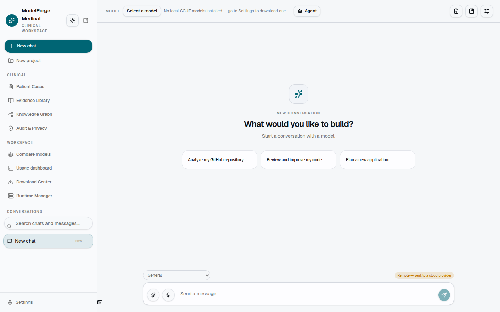
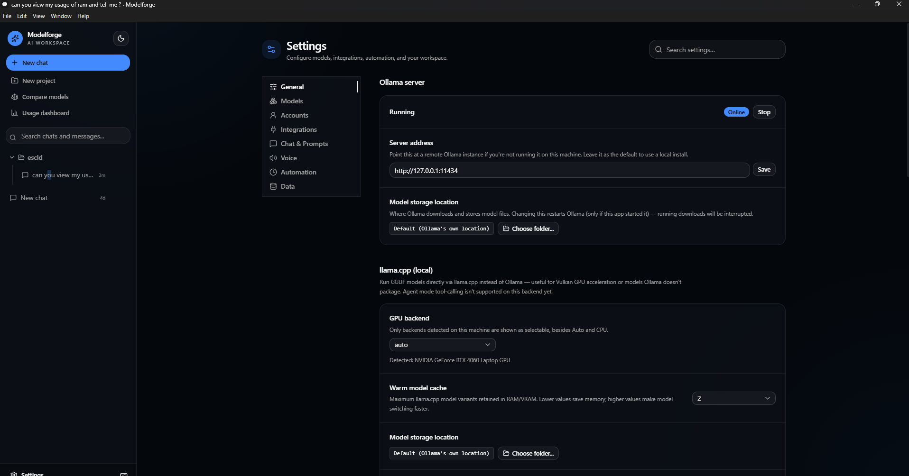
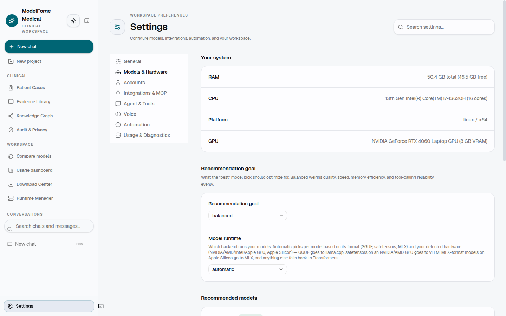
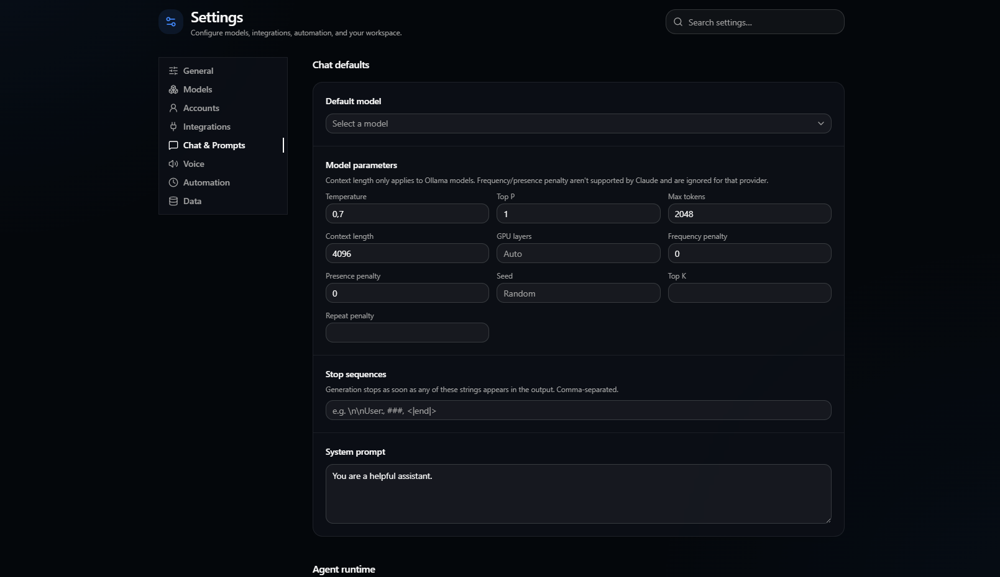
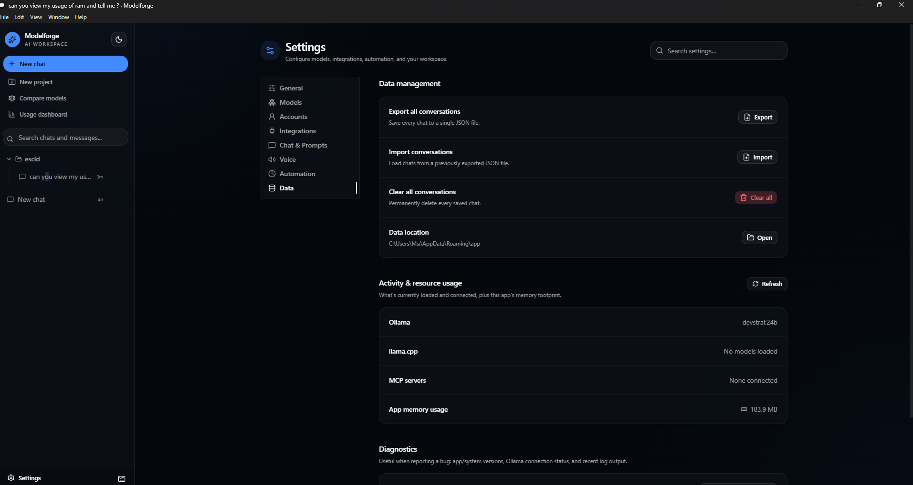

# Modelforge

[](https://github.com/voidstackloop/modelforge/actions/workflows/ci.yml)
[](https://github.com/voidstackloop/modelforge/releases/latest)
[](LICENSE)

A cross-platform desktop client that unifies local and cloud AI models in one interface: [Ollama](https://ollama.com) for local inference, plus OpenAI and Anthropic for cloud models. Built with Electron, React, and TypeScript.

Beyond chat, Modelforge includes an **agentic mode** — the model can read/write files and run shell commands in a folder you choose, with every action gated behind your explicit approval.



## Contents

- [Features](#features)
- [Screenshots](#screenshots)
- [Installation](#installation)
- [Quick start](#quick-start-try-it-in-5-minutes)
- [Agent mode](#agent-mode)
- [Building from source](#building-from-source)
- [Documentation](#documentation)
- [Testing](#testing)
- [Security](#security)
- [Contributing](#contributing)
- [License](#license)

## Features

**Chat & providers**
- Local Ollama models, OpenAI, Anthropic, Google Gemini, **and llama.cpp** in one interface, with token-by-token streaming.
- **Custom OpenAI-compatible providers** — add Groq, Mistral, DeepSeek, xAI (Grok), OpenRouter, a self-hosted server, or any other endpoint that speaks the OpenAI chat-completions format, via one shared implementation rather than a dedicated client per vendor. Quick-add presets fill in the base URL for the popular ones; you just paste an API key.
- **llama.cpp backend** — run GGUF models directly via [node-llama-cpp](https://github.com/withcatai/node-llama-cpp) instead of Ollama, with **Vulkan**, CUDA, or Metal GPU acceleration (auto-detected, selectable in Settings). Useful for Vulkan acceleration or models Ollama doesn't package. This is an *additional* backend, not a replacement — Ollama is still fully supported side by side. Agent mode tool-calling isn't wired up for this backend yet (a clear error explains this if you try); everything else (streaming, GPU offload, all the generation parameters) works the same as any other provider. Model weights load once and stay warm across messages, but each turn currently re-evaluates the full conversation from scratch rather than reusing a cache across turns — correct, but slower on long conversations than it could be.
- Vision support — attach images (or extract frames from a video) for models that can see them. When an image is attached, an **"Analyze as..."** menu fills the composer with a ready-made prompt for common diagram/wireframe tasks — describe the UI, convert it to a Mermaid diagram, generate React + Tailwind code from it, list its components, or review it for usability/accessibility issues.
- Live token usage and estimated cost per message and per session (Ollama is free/local; cloud providers show a running estimate).

**Organization**
- **Projects** — group related chats under shared instructions and default model parameters.
- **Per-session and per-project overrides** — pin a specific prompt, model, temperature, seed, top-K/top-P, repeat penalty, context length, GPU offload, or stop sequences to a single chat or an entire project, falling back to sane defaults. Provider-specific parameters (e.g. seed isn't supported by Claude, top-K isn't supported by ChatGPT) are automatically disabled when they don't apply to the selected model.
- **Prompt library** — save and reuse system prompts across chats. Prompts can include `{{variables}}` (e.g. `{{topic}}`) that you fill in each time you apply one, and edits keep version history so a bad change can be restored.
- **Command palette** (`Ctrl/Cmd+K`) — jump between chats, projects, settings, and Compare without touching the mouse.
- **Keyboard shortcuts cheat-sheet** (`Ctrl/Cmd+/`, or the keyboard icon next to Settings) — everything you can do without the mouse, in one place.
- **Compare models** — send one prompt to several models at once (local or cloud) and see every response stream in side by side, with per-model token counts and cost estimates.
- **Full-text search** — the sidebar search box matches message content across every chat, not just titles.
- **Tags** — label chats with freeform tags and filter the sidebar by them; lighter-weight than Projects for ad-hoc organization.
- **Pin messages** — bookmark any message in a chat and jump straight to it from a "Pinned" panel in the toolbar.
- **Fork a conversation** — branch a new chat from any earlier message, keeping everything up to that point and continuing independently from there.

**Files & retrieval**
- Attach files, folders, images, video, and PDFs directly into a conversation.
- Large folders are automatically chunked, embedded (via Ollama), and retrieved by relevance instead of dumped whole into the prompt — so a big project doesn't blow out a small model's context window.
- **Screenshot capture** — pick a screen or window from the Attach menu and it's captured and attached as an image, no separate screenshot tool needed. (macOS may require granting Screen Recording permission the first time.)
- **OCR** — extract plain text from any attached image with one click, dropped straight into the composer. Runs fully offline via [tesseract.js](https://github.com/naptha/tesseract.js) after its first use (which needs network access once, to download the ~2MB English text-recognition model).
- **Figma frame import** — add a personal access token in Settings → Integrations, then paste a "Copy link to selection" URL from Figma to fetch that frame as an image, attached like any other screenshot.
- **Prompt library sharing** — export your saved prompts to a JSON file and import one a teammate sent you (Settings → Chat & Prompts). There's no live sync — it's just a plain file, sent however you like.

**Agent mode** — see the [dedicated section](#agent-mode) below.

**Automation**
- **Scheduled tasks** (Settings → Automation) — run a saved prompt against a chosen model on a repeating interval while the app is open, with results appended to a dedicated chat for that task so you get a running log rather than a new chat every time. This only runs while Modelforge is open (there's no OS-level background service), and doesn't use Agent mode tools — it's plain scheduled chat completions, not a scheduled agent run.

**Models & hardware**
- Model recommendations based on your actual hardware — RAM and VRAM are detected and summed **across all GPUs**, not just the first one, so multi-GPU machines get accurate suggestions.
- **GPU offload control** — set how many model layers Ollama offloads to GPU (`num_gpu`) per chat, per project, or as a global default; leave it blank to let Ollama decide automatically.
- **Custom local GPU backends** — register any OpenAI-compatible local endpoint as a no-key GPU backend, including vLLM, LocalAI, TGI, vendor runtimes, and custom CUDA/ROCm/SYCL/Vulkan llama-server builds. Models from these endpoints appear beside other custom providers and retain streaming and Agent tool-calling support when the server supports it.
- **Bounded VRAM cache** — llama.cpp model loads are coalesced, active models are protected, and idle model/offload variants are evicted least-recently-used so switching models does not grow VRAM use without limit.
- **Real Hugging Face search** — typing in the model search box queries the actual Hugging Face Hub API (not just "paste an exact URL"), showing real repos ranked by downloads/likes; expand one to see its actual GGUF files with real file sizes, then either pull it via Ollama or download it directly for the llama.cpp backend. Pasting an exact `hf.co/user/repo` tag or a full URL still works too, for Ollama's own pull mechanism.
- Models with reliable tool/function-calling support are flagged with a 🔧 badge, so picking a good Agent mode model doesn't require guesswork.
- **Custom model storage location** — Settings → General → Ollama Server → "Model storage location" lets you point downloaded models at any folder (e.g. a larger or faster drive) instead of Ollama's default location. If this app started Ollama, it restarts it automatically with the new location; if Ollama is running outside the app, you're told to restart it yourself.

**Customization & control**
- **First-run setup** — on first launch, pick which provider you want to start with (a local one, or a cloud one with its API key) right away, instead of hunting through Settings. Skippable, and only shown once.
- **Settings is organized into a sidebar** (General, Models, Integrations, Chat & Prompts, Voice, Automation, Data), each with its own icon — it holds up better as more settings get added over time than one long scrolling page.
- English and Turkish UI localization.
- **Theming** — light/dark/system color mode plus a choice of accent colors (default gray, blue, green, purple, orange, rose), in Settings → General → Appearance.
- Configurable Ollama host — point at a remote server instead of localhost.
- Data export/import, and one-click "copy diagnostic info" for bug reports.
- **Updates** — packaged builds check GitHub Releases for new versions automatically on launch, plus a manual "Check for updates" button in Settings (also available from the app menu).

**Voice**
- **Voice input** — record a question with the mic button; it's transcribed via OpenAI's Whisper API and dropped into the composer (requires an OpenAI API key in Settings, even when chatting with a local Ollama model).
- **Read aloud** — any assistant reply can be played back through your OS's own text-to-speech voices, with a per-message speaker button, an optional "auto-read every response" toggle, and a voice picker with a test button in Settings → Voice tab. Works fully offline, no API key needed.
- Both are start/stop/cancel controllable mid-action — stop a reply from being read, or cancel a recording before it's sent for transcription.
- Not included: fully real-time, bidirectional voice conversation (speaking over the model and having it react instantly, à la OpenAI's Realtime API). That's a different streaming architecture and hasn't been built.

## Screenshots

<details>
<summary>Server, system info, and model catalog</summary>



</details>

<details>
<summary>Browsing and pulling models, with tool-calling badges for Agent mode</summary>



</details>

<details>
<summary>Chat defaults and prompt library</summary>



</details>

<details>
<summary>Data management and diagnostics</summary>



</details>

## Installation

Download the latest installer for your platform from the [Releases](../../releases) page.

| Platform | File | Notes |
|---|---|---|
| Windows | `Modelforge Setup *.exe` | Unsigned — Windows SmartScreen will warn on first run ("Unknown publisher"); click **More info → Run anyway**. |
| macOS | `Modelforge-*.dmg` (Intel) / `Modelforge-*-arm64.dmg` (Apple Silicon) | ⚠️ **Not yet verified on real hardware.** Builds for both architectures and should run — Electron is cross-platform and nothing in this codebase is OS-specific — but no one has confirmed it on an actual Mac. Also unsigned/unnotarized, so Gatekeeper will block it until you right-click → **Open**. Please [open an issue](../../issues) if you try it, either way. |
| Linux | `Modelforge-*.AppImage` | Make it executable (`chmod +x`) and run directly, or use your AppImage launcher of choice. |

No installer signing certificate is configured yet, so every platform will show some form of "unknown publisher" warning on first launch — this is expected for an unsigned build, not a sign of a corrupted download.

Modelforge talks to a local [Ollama](https://ollama.com) install by default — no API key required. OpenAI and Anthropic support is optional: add your API key in **Settings** only if you want to use those providers.

## Quick start: try it in 5 minutes

1. **Install [Ollama](https://ollama.com/download)** and pull a small model to test with: `ollama pull llama3.2`.
2. **Install and launch Modelforge.** On first launch it detects your local Ollama install automatically — no setup screen, no account, no API key.
3. **Send a message.** Pick `llama3.2` from the model dropdown and chat — you should see the response stream in token-by-token.
4. **Try an attachment.** Drop in an image (with a vision-capable model like `llama3.2-vision`) or a PDF and ask a question about it.
5. **Create a Project.** Group a couple of chats under one project with a shared system prompt, and confirm new chats in that project inherit it.
6. **Open the command palette** with `Ctrl/Cmd+K` and jump between chats without touching the mouse.
7. **Check Settings** — switch the UI language (English/Turkish), add an OpenAI or Anthropic key if you want to compare a cloud model side-by-side with a local one, or point "Ollama host" at a remote server.

If steps 2–3 work, the core app is functioning correctly — everything else layers on top of that same chat pipeline.

## Agent mode

Click **Agent** in the chat toolbar and pick a folder — that becomes the model's sandboxed workspace for the rest of the conversation. The model can then call a wide catalog of tools: file read/write/search/patch, shell and background commands, an interactive terminal, read-only and commit git operations, and network tools (web search, arbitrary HTTP requests, linked-GitHub repo access). **See [docs/AGENT_MODE.md](docs/AGENT_MODE.md) for the full, current tool table** — the summary below covers the safety model, which is the part worth understanding before you use it.

**Safety model:**
- Built-in filesystem tools are genuinely confined to the chosen workspace folder — path traversal (`../../etc`), absolute paths elsewhere on disk, and symlinks that resolve outside the workspace are rejected before anything runs.
- `run_command` and `run_code` are different: a shell command (or a script `run_code` hands to `python3`/`node`) is opaque text that can reference any path on the system regardless of its working directory, so neither is confined the way the file tools are. Where the OS supports it, commands run inside a real sandbox instead (bubblewrap on Linux, `sandbox-exec` on macOS — Windows has no equivalent). As a safety net everywhere, commands (and `run_code`'s source text) matching destructive or system-level patterns — deleting outside the workspace, formatting a drive, shutting down the machine, registry deletion, `sudo`/`runas`, piping a remote script into a shell — are **rejected outright**, even if already approved. This blocklist catches the common catastrophic cases, not everything a shell or script can do — only approve a command or snippet you actually understand.
- Every call (including ones the blocklist doesn't catch) shows an **Allow / Deny** card before it executes — nothing runs without an explicit click. A narrow set of strictly read-only, no-network tools can be marked "always allow this session" to cut down on repetitive approvals; anything that mutates the workspace, runs code, or touches the network always requires a fresh click, since those have real, potentially irreversible or unattended-outbound-channel effects — see [docs/AGENT_MODE.md](docs/AGENT_MODE.md#safety-model) for exactly which tools qualify and why.
- A per-turn step limit (25 tool-result → model-continuation round trips) stops a model from looping indefinitely without producing a final answer.
- The trust list for "always allow" is in-memory only — closing and reopening a chat resets it.
- A Settings toggle can disable every network-capable tool at once, for a fully offline, filesystem-and-shell-only workflow.

**Preview & Rollback:**
- A pending `write_file` call shows a real **line-by-line diff** against the file's current content (or a "new file" badge if it doesn't exist yet) instead of a raw argument dump, so you can see exactly what would change before clicking Allow.
- **Undo last edit** reverts the most recent applied `write_file` — restoring the previous content, or deleting the file if the edit created it. Undo history is per-workspace, capped at the last 20 writes, and lives only in memory for the running session (not a durable version history).

**Quick actions:** if the workspace has `test`/`lint`/`format` scripts in its `package.json`, **Run Tests**, **Lint**, and **Format** buttons appear in the toolbar — they run the corresponding `npm` script directly (reusing the same sandboxing as `run_command`) and drop the output into the chat, without going through the model.

**MCP (Model Context Protocol) servers:** add external MCP servers in Settings to give Agent mode extra tools — anything from a database query tool to a browser-automation server. Two transports are supported:
- **stdio** — launches a local command (e.g. `npx -y @modelcontextprotocol/server-filesystem /some/path`) and speaks JSON-RPC over its stdin/stdout.
- **HTTP** — connects to a remote MCP server's "Streamable HTTP" endpoint.

Enabled servers reconnect automatically on launch; each server's tools appear in Agent mode's tool list prefixed with the server's name, going through the exact same Allow/Deny approval flow as built-in tools. (SSE and plain WebSocket transports aren't implemented — SSE is the legacy MCP HTTP transport, now superseded by Streamable HTTP, and WebSocket isn't part of the MCP spec itself.)

**MasterVault (bundled):** a built-in MCP server ([`mastervault-mcp-server/`](mastervault-mcp-server/)) ships with Modelforge — it serves a plain folder of notes as a "MasterVault" (orientation file, a decision log with confidence calibration, soft-delete-only file removal) to Agent mode, no Obsidian or separate install required. In Settings → Integrations → MCP servers, click **Add MasterVault** and pick a vault folder; it's added and removed exactly like any other MCP server. See its own [README](mastervault-mcp-server/README.md) for the full tool list and security model.

**Model choice matters.** Agent mode works with whatever model you point it at, but only actually produces tool calls if that model was trained for function/tool calling — a model without that training will just chat normally and never call a tool. The Settings model browser flags models with reliable tool-calling support with a 🔧 **Tool calling** badge (e.g. the Qwen3 family, Llama 3.1+, Mistral Nemo, Qwen2.5-Coder, Devstral). The llama.cpp backend doesn't have tool-calling wired up yet — see [Features](#features) above.

## Building from source

Requires [Node.js](https://nodejs.org) 22+.

```sh
git clone https://github.com/voidstackloop/modelforge.git
cd modelforge

# install dependencies
npm install --prefix frontend
npm install --prefix app

# run in development (starts the Vite dev server + Electron)
npm run dev --prefix app

# build a distributable installer for your current platform
npm run package --prefix app
```

Packaged installers are written to `app/release/`. For the full development workflow (hot reload,
rebuilding the native Rust addon, cross-platform packaging details, CI/release pipeline), see
[docs/DEVELOPMENT.md](docs/DEVELOPMENT.md).

## Documentation

This README covers what the app does and how to install/build it. For anything deeper:

- **[docs/ARCHITECTURE.md](docs/ARCHITECTURE.md)** — how the Electron main/renderer/preload split works, the IPC bridge, the native Rust downloader addon, the persistence pattern (atomic writes, corruption recovery), and the end-to-end data flow for sending a chat message.
- **[docs/AGENT_MODE.md](docs/AGENT_MODE.md)** — the full Agent mode tool catalog, the workspace-sandboxing and OS-level command-sandboxing model, the tool-approval policy and exactly why each tool is or isn't auto-approvable, and MCP server integration.
- **[docs/DEVELOPMENT.md](docs/DEVELOPMENT.md)** — prerequisites, running in dev mode, testing, building, packaging installers for each platform, and the project's directory layout.
- **[ml/hardware-recommender/README.md](ml/hardware-recommender/README.md)** — the standalone Python project that trains the hardware/model-fit recommender. Its training pipeline isn't part of the app's build, but its trained checkpoint ships with the app and is used at runtime via a Python worker to enhance the Models & hardware recommendations mentioned above.

## Testing

```sh
npm test --prefix frontend
npm test --prefix app
```

The `app` suite covers the store layer (atomic writes, corrupted-file recovery), the agent tools (including path-traversal rejection and shell command execution), and the RAG chunking/similarity logic. Both suites run in CI on every push and pull request via [`.github/workflows/ci.yml`](.github/workflows/ci.yml), which also lints, typechecks, and builds both packages. See [docs/DEVELOPMENT.md](docs/DEVELOPMENT.md#testing) for what each suite specifically exercises.

## Security

- **Process isolation**: `contextIsolation: true`, `nodeIntegration: false` — the renderer only ever talks to the main process through an explicit, typed preload bridge.
- **Content Security Policy** restricting plugins, frames, and form submissions; external links open in your default browser instead of an unmanaged Electron window.
- **API keys** are encrypted at rest via the OS credential store (`safeStorage`) and never leave the device. On the rare system with no OS credential store available (e.g. some keyring-less Linux setups), keys fall back to being stored in plain text on disk rather than being silently dropped — Settings shows a prominent warning in that case rather than the normal "encrypted" note.
- **Agent mode** tool calls are workspace-sandboxed (path-traversal rejected) and require explicit per-call approval — see [Agent mode](#agent-mode) above and [docs/AGENT_MODE.md](docs/AGENT_MODE.md) for the full detail.
- No telemetry, no analytics, no data sent anywhere except directly to whichever provider (Ollama, OpenAI, Anthropic) you've configured.

## Contributing

Issues and pull requests are welcome. See [docs/DEVELOPMENT.md](docs/DEVELOPMENT.md) for the full setup and testing workflow. Before opening a PR, please make sure:

```sh
npm run lint --prefix frontend
npm run build --prefix frontend
npm run build --prefix app
npm test --prefix frontend
npm test --prefix app
```

all pass — this is the same set of checks CI runs.

## License

[MIT](LICENSE)
